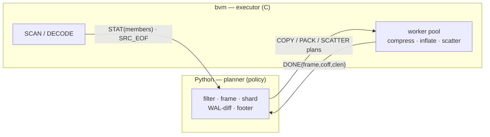
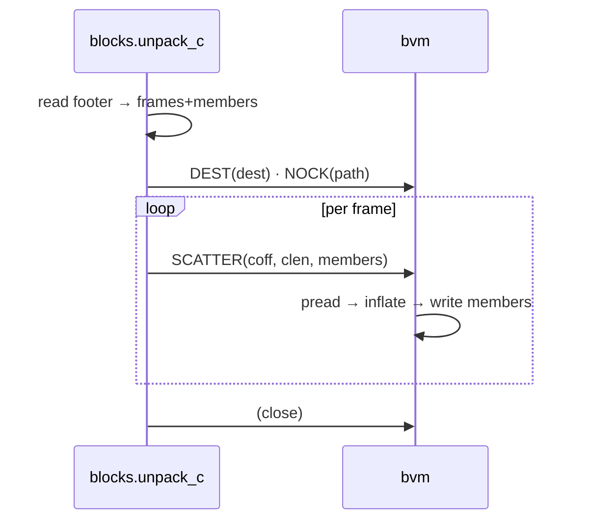
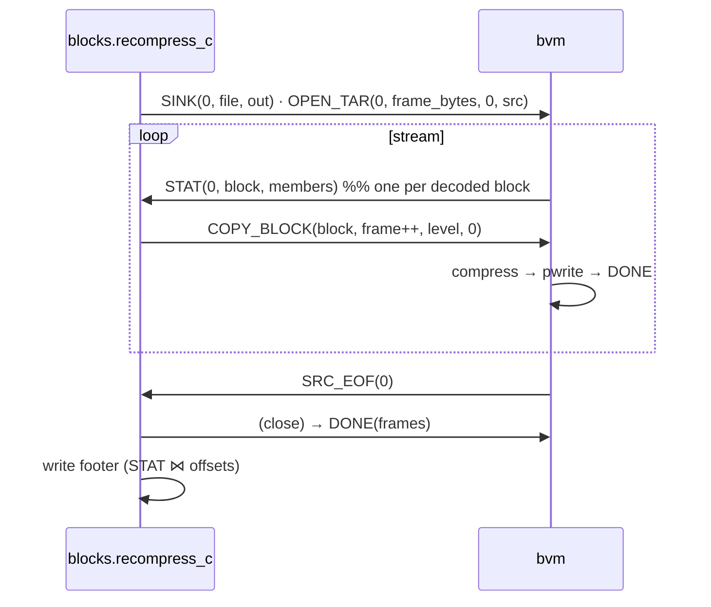
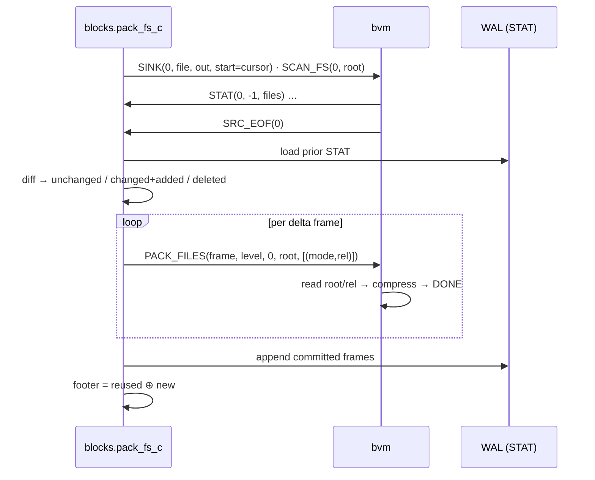
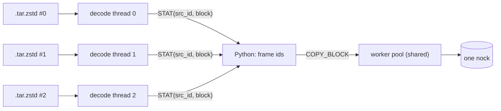
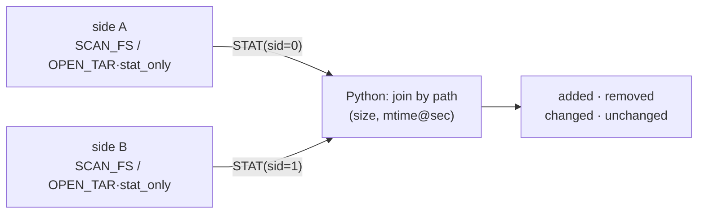
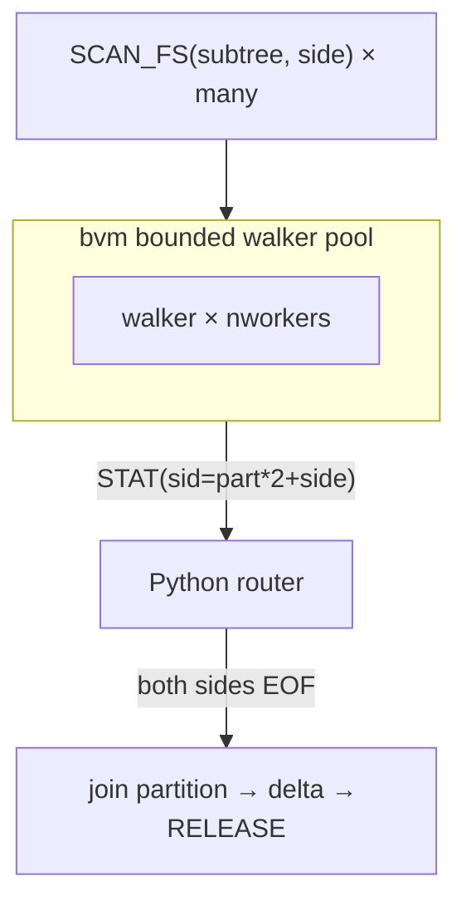
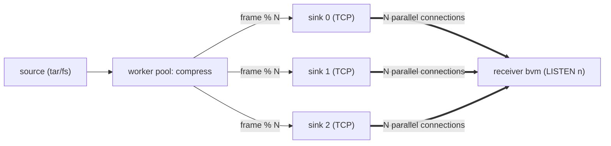
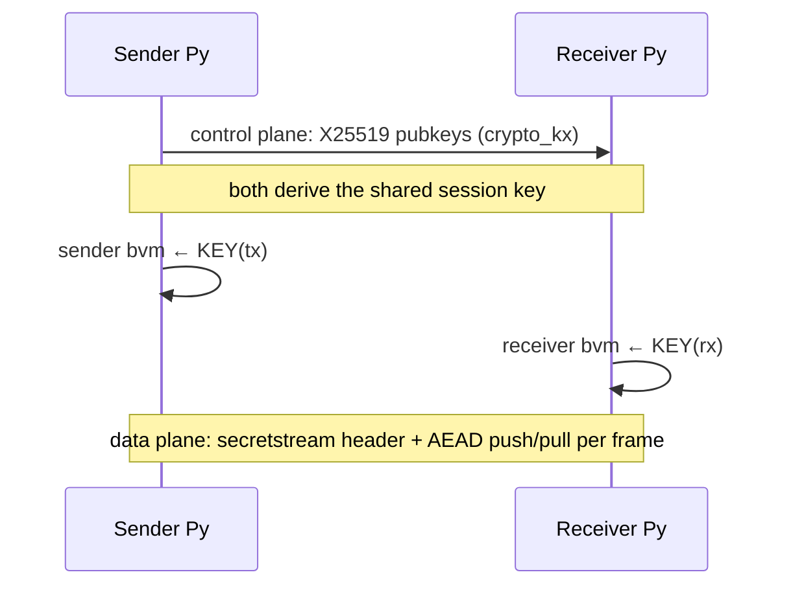
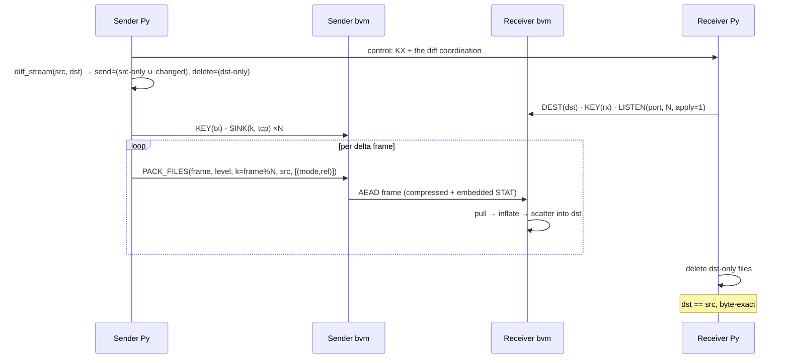

# BLOCKS dataflow — modes & setup

How data moves through the BLOCKS executor ([`bvm`](../quiver/exec/bvm.c)) and its
planner ([`blocks.py`](../quiver/exec/blocks.py)), mode by mode. See
[BLOCKS.md](BLOCKS.md) for the model.

## The one contract

**Python is the brain, bvm is the sensor + actuator.** Python holds policy
(filter / frame / shard / WAL-diff); bvm does the I/O-bound, parallel, or
compute-heavy work (SCAN a tree, DECODE an archive, COMPRESS, INFLATE, SCATTER,
send/receive over TCP). Because it is bvm that *discovers* members, **bvm streams
STAT up; Python streams the plan down; bvm streams results up** — incrementally,
full-duplex over one pipe.



Nothing is materialized whole: SCAN ‖ plan ‖ execute overlap, a **block budget**
bounds decode memory, and a **bounded work queue** makes the old fiber-flood
overflow structurally impossible.

### The wire

One process: `bvm <nworkers> <budget_mb>`. Every message is `[u32 len][u8 type][payload]`.

| Py → bvm | meaning |
|---|---|
| `SINK(id, kind, start, spec)` | open output sink `id`: `kind` 0 = file (`spec`=path), 1 = TCP (`spec`=`host:port`) |
| `DEST(path)` | target dir for scatter / apply |
| `NOCK(path)` | source nock for `SCATTER` |
| `OPEN_TAR(sid, frame_bytes, stat_only, path)` | decode a `.tar.zstd`; `stat_only`=1 → headers only |
| `SCAN_FS(sid, root)` | enqueue a subtree walk (bounded walker pool) |
| `COPY_BLOCK(block, frame, level, sink)` | compress a held decoded block → sink |
| `PACK_FILES(frame, level, sink, root, [(mode, rel)])` | read `root/rel` files, compress → sink |
| `SCATTER(coff, clen, [members])` | inflate a nock frame → write members to `DEST` |
| `SKIP(block)` | free a held block (dedup) |
| `KEY(32B)` | session key (from control-plane KX) — before TCP sinks / LISTEN |
| `LISTEN(port, n, apply)` | receive on `n` connections; `apply`=1 → inflate+scatter, 0 → store nock |

| bvm → Py | meaning |
|---|---|
| `STAT(sid, block, members)` | members bvm discovered (`block`=-1 for fs; ≥0 = a held decoded block) |
| `SRC_EOF(sid)` | a source is exhausted |
| `DONE([(frame, coff, clen)])` | completions (buffered, sent at the end) |

Members in `STAT` carry `in_off, size, mode, mtime, uid, gid, path`.

Every command is length-prefixed. A `SINK(0, "out.nock")` on the wire:

```
[u32 len][u8 1][u32 0][u8 0][i64 0][u16 8]["out.nock"]
          SINK  id=0   kind  start  plen    path
                       =file
```

### Data plane — sink kinds & frame layout

A `COPY`/`PACK` targets one sink by `sink_id`. Two kinds:

**File sink** (`kind=0`) — seekable. A worker compresses, reserves an offset under
the sink lock (`coff = cursor; cursor += clen`), `pwrite`s at `coff`, and reports
`DONE(frame, coff, clen)`; Python builds the footer.

**TCP sink** (`kind=1`) — a stream; the receiver assigns offsets. A worker writes a
**self-contained** frame message:

```
[u32 L][ payload ]                 L = len(payload), or len(ciphertext) if a KEY is set
payload = [u64 frame_id][u64 clen][u32 statlen][ STAT ][ compressed · clen bytes ]
STAT    = [u32 nmemb]( [i64 in_off][i64 size][u32 mode][u16 plen][rel path] )*
```

- `statlen = 0` → **store**: the receiver appends `compressed` to its nock.
- `statlen > 0` → **apply-on-fly**: the embedded member STAT lets the receiver
  inflate + scatter to `DEST` with **no control-plane lookup**.
- With a `KEY`, the whole `payload` is one `crypto_secretstream` push (the 24-byte
  stream header precedes the first frame on each connection); the receiver `pull`s.

### Worked examples (control-plane ops)

Real `_Bvm` session sequences, with values.

**recompress** — `.tar.zstd → nock`:
```python
b = _Bvm(bvm, nworkers=16, budget_mb=512)
b.sink(0, "out.nock")                       # SINK   id=0 kind=file
b.open_tar(0, "podcasts.tar.zstd", 8 << 20) # OPEN_TAR sid=0 frame_bytes=8MiB
fid = 0
while True:
    t, pl = b.read()                        # STAT(sid, block, members) …
    if t is None or t == 1:                 # … until SRC_EOF
        break
    _sid, block, members = _parse_stat(pl)
    b.copy_block(block, fid, level=6)        # COPY_BLOCK  block frame level → file sink 0
    fid += 1
locs = b.finish()                           # DONE {frame: (coff, clen)}
# footer = members ⋈ locs
```

**incremental pack** — `fs → nock`, WAL-driven:
```python
b.sink(0, "store.nock", start=prior_end)    # append past the prior frames
b.scan_fs(0, "/data/tree")                  # bvm walks → STAT(0, -1, files) … SRC_EOF
# read STAT; WAL-diff → unchanged (reuse) / changed+added (send) / deleted (drop)
for frame, members in framed_delta:
    b.pack_files(frame, 6, "/data/tree", [(mode, rel), ...])   # PACK_FILES → file sink 0
```

**networked streaming rsync** — both ends bvm, sharded + encrypted:
```python
# ── receiver ──
recv.dest("/target"); recv.key(session_key)
recv.listen(9000, 4, apply=1)               # 4 conns; apply-on-fly (inflate+scatter)
# ── sender ──
send.key(session_key)                       # session_key from X25519 crypto_kx (control plane)
for k in range(4):
    send.sink(k, "host:9000", kind=1)       # 4 TCP data connections (AEAD each)
for frame, members in framed_delta:         # delta = diff_stream(src,dst) send-list
    send.pack_files(frame, 6, "/src", members, sink_id=frame % 4)   # SHARDED
```

---

## Local modes

### unpack · NOCK → FS

Python reads the footer (it *is* a STAT table), then streams one `SCATTER` per
frame; bvm inflates each frame once and scatters its members to disjoint files. A
`predicate` (e.g. `frame % nnodes == k`) is the per-frame distributed unpack.



### recompress · .tar.zstd → nock

bvm **DECODEs** the archive (streaming zstd + tar parse) into whole-member frames,
holding each as a budgeted block and streaming its member STAT up. Python assigns a
dense frame id and sends `COPY_BLOCK`; a worker compresses the block, appends to the
sink, and reports `DONE`. Python writes the footer from the STAT + offsets.



A `.nock` source is faster (frames already exist, no tar parsing); the block budget
+ backpressure keep memory bounded regardless of archive size.

### pack · FS → nock (incremental, WAL-driven)

bvm **walks** the tree (bounded walker pool) and streams file STAT. Python joins it
against the **WAL** (a durable STAT table): `unchanged` reuse the prior locator;
`changed`/`added` are framed and sent as `PACK_FILES`; `deleted` drop. Only the delta
is read + compressed; the nock grows in place; the WAL is appended.



### multi-tar · N archives → one nock

Several `OPEN_TAR` in one session run **N decode threads concurrently** (shared
worker pool + block budget). STAT is tagged by `src_id`; members from all sources
land in one footer — this parallelizes the otherwise-serial per-source decode.



### two-tree diff · tar-vs-fs / fs-vs-fs

Open both sides in one session — `SCAN_FS` for a tree, `OPEN_TAR(stat_only=1)` for
an archive (headers only, bodies skipped). Both stream STAT (tagged by side);
Python joins by path → `added / removed / changed / unchanged` by (size, mtime).



### fine-grained parallel streaming diff

Partition by subtree; fan **many** `SCAN_FS(subtree)` at the bounded walker pool; as
each partition's **both** sides hit `SRC_EOF`, join + emit + **release** it. Only
in-flight partitions are ever held — never the whole tree. This is the streaming-rsync
foundation.



---

## Networked modes

### parallel TCP transfer (sharding)

A `SINK` can be a **TCP socket**. `COPY`/`PACK` carry a `sink_id`, so frames are
**sharded across N socket sinks = N parallel data connections** (GridFTP/bbcp style).
Each socket frame is self-contained: `[u32 L][ frame_id · clen · statlen · member-STAT · compressed ]`.



### encryption (libsodium)

The session **key is negotiated on the control plane** (X25519 `crypto_kx`, may ride
SSH) — no pre-shared secret. Each side hands the derived key to its bvm via `KEY`.
Each TCP connection is then an authenticated stream (`crypto_secretstream`): the header
is sent first, every frame is one authenticated push, the receiver pulls.



### streaming rsync · apply-on-fly

The capstone: fine-grained streaming **diff** → transfer **only the delta** over N
parallel encrypted connections → the receiver `LISTEN(apply=1)` **decrypts, inflates,
and scatters straight to the target fs in C — nothing stored**. Because socket frames
carry their member STAT, the receiver needs no control-plane lookup mid-stream. Deletes
are applied control-side.



Set `apply=0` instead to **store** the received stream as a nock (a remote
archive/backup) — the same data plane, a different far-end action.

---

## Mode setup at a glance

| mode | source | sink(s) | key commands |
|---|---|---|---|
| unpack | nock (Py footer) | fs (`DEST`) | `DEST` · `NOCK` · `SCATTER`× |
| recompress | `OPEN_TAR` | file | `SINK(file)` · `OPEN_TAR` · `COPY_BLOCK`× |
| pack (incremental) | `SCAN_FS` + WAL | file | `SINK(file,start)` · `SCAN_FS` · `PACK_FILES`× |
| multi-tar | `OPEN_TAR`×N | file | N×`OPEN_TAR` · `COPY_BLOCK`× |
| diff | 2× `SCAN_FS`/`OPEN_TAR·stat_only` | — | join in Py |
| streaming diff | many `SCAN_FS(subtree)` | — | pool + per-partition join/release |
| networked store | tar/fs | N× `SINK(tcp)` | `KEY` · N×`SINK(tcp)` · sharded `COPY`/`PACK` |
| streaming rsync | fs delta | N× `SINK(tcp)` → receiver `LISTEN(apply=1)` | `KEY(KX)` · `PACK_FILES` sharded · apply |

---

## Measured

Numbers from validation runs (the source `podcasts_dyadic_data_v2` is the
large-member case — mean member 1.56 MB, max 6.5 MB — that produced 15.7 % null
`frame_coff` and phantom members in the old windowed/coalesce paths).

| mode | workload | result |
|---|---|---|
| recompress | podcasts: 18,400 members, 6.6 GB `.tar.zstd` | 42.7 s · 3,894 frames · dense · 0 null_coff · byte-exact — **10× the Python `tarfile` path** (431.6 s) |
| unpack | podcasts: 18,400 members | 31.3 s (≈880 MB/s, write-bandwidth-bound) · byte-exact — **6× the Python reference** (183.7 s) |
| unpack, distributed | per-frame split, 4 nodes | **32,020 files/s = 4.65× 1-node** (super-linear; splits the per-nock long pole) |
| incremental pack | mutate a tree, re-pack | `unchanged=2 · packed=2 · deleted=1` · byte-exact; a mtime-only touch = 0 re-store (dedup) |
| multi-tar | 3 tars → one nock | 60 members, concurrent decode, byte-exact |
| two-tree diff | fs-vs-fs + tar-vs-fs | added/removed/changed/unchanged correct (PAX mtime handled) |
| streaming diff | 12 subtrees / 358 files | matches materialized diff; only in-flight partitions held |
| networked (bvm↔bvm) | 300 members / 29 frames | **4 AEAD connections**, X25519 control-plane KX, byte-exact |
| streaming rsync | send 3 · delete 1 | apply-on-fly into the target, **DST == SRC byte-exact** (0 miss/mismatch/extra) |
| EVI corpus (one nock/source) | 109 sources, 2.4 TB | **33,833,483 members** — exact match to the prior zframe run |

Every old-ISA bug class (sparse frame-ids → null_coff, phantom members from window
carry, `-EMSGSIZE` oversize, the 140k-frame QCAP segfault) is gone **by
construction** in this model — verified on the exact source that broke the old paths.
