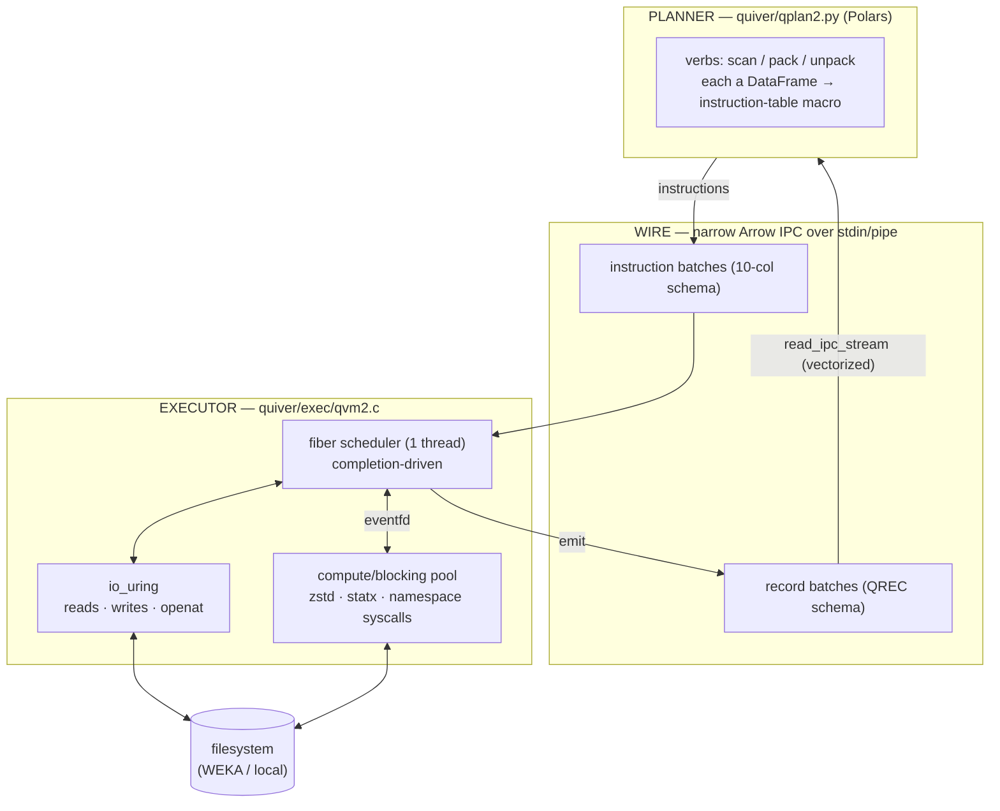
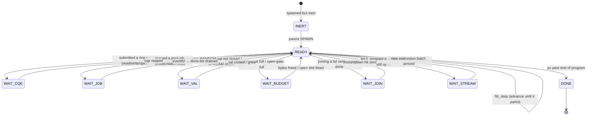
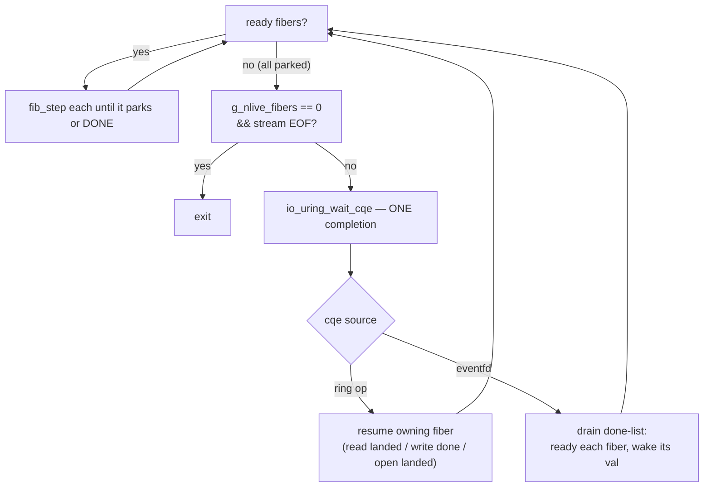
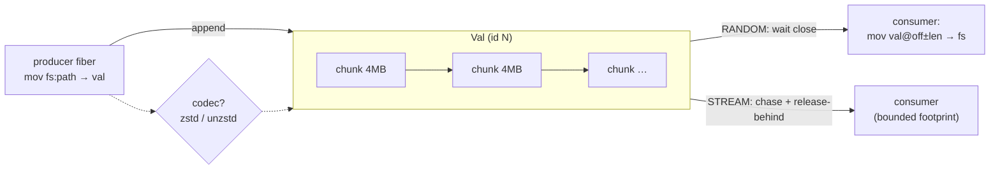
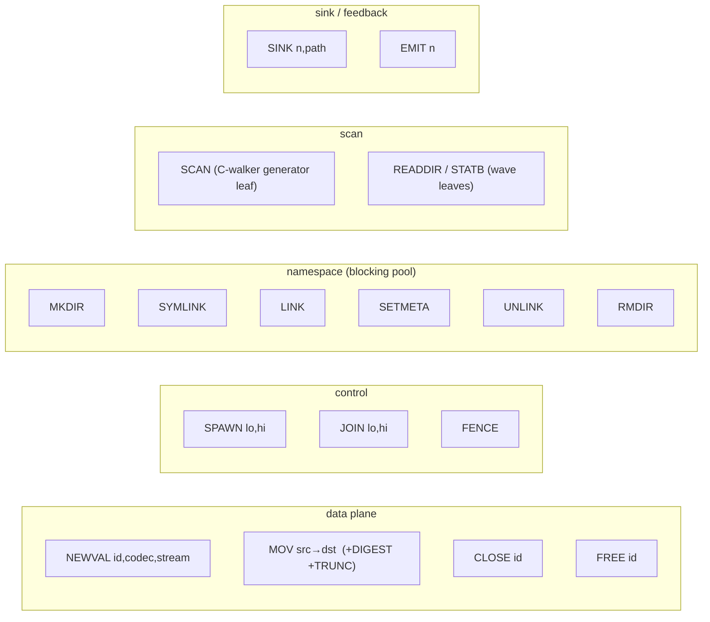
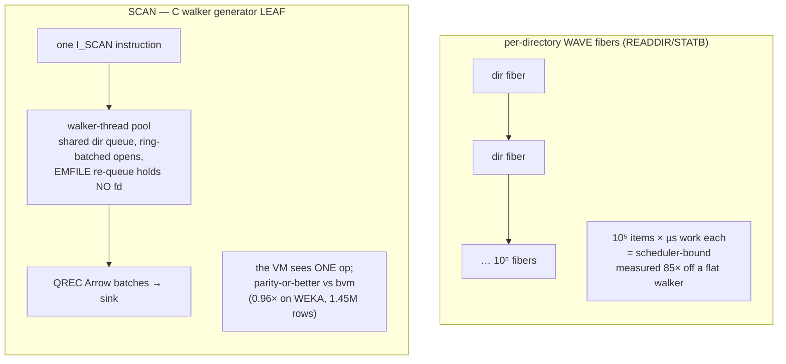
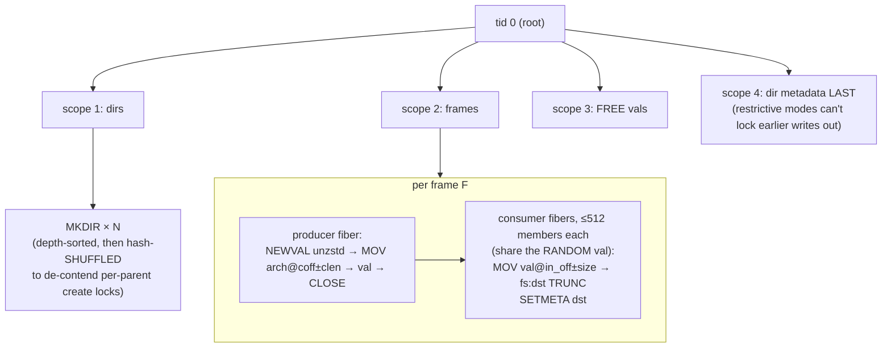
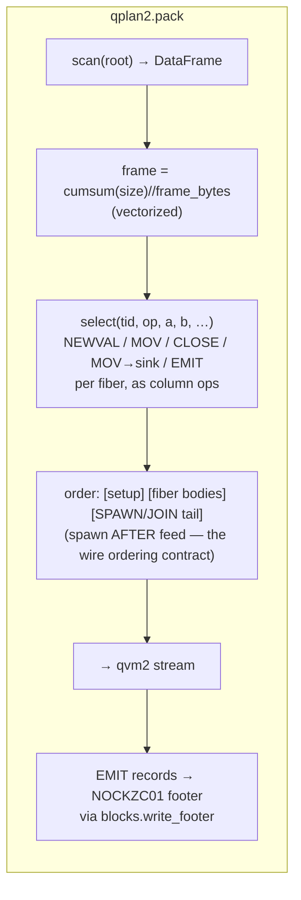
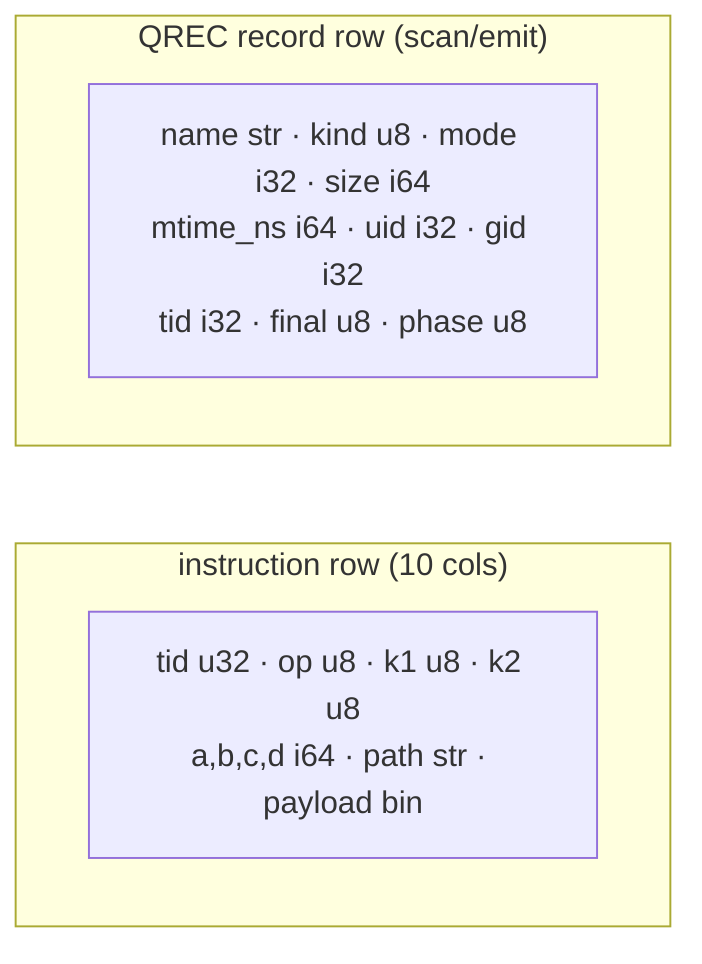

# qvm2 — the fiber-VM architecture

> How the shipped executor (`quiver/exec/qvm2.c`) and its planner
> (`quiver/qplan2.py`) actually work. `docs/ISA3.md` is the design rationale and
> the post-mortem of the static-memory model this replaced; `docs/MACHINE.md` is
> the VM-lens framing. This document is the *built* system, with diagrams.

## 1. The three layers

quiver is a virtual machine for IO: a **compiler** (Polars) lowers high-level
intent into a narrow instruction stream, an **executor** (qvm2, C) runs it over
io_uring + a thread pool, and **completions** flow back as Arrow record batches.

The wire is deliberately coarse-in, coarse-out: one instruction batch carries
~10⁵ rows, one record batch the same, so the Polars planner pays per-*batch*
cost, never per-*member*. Everything below the wire is C.

## 2. The scheduler: fibers over completions

A **fiber** is a lightweight sequential program (a list of `Instr`) with a
program counter and one **cursor** of in-flight transfer state. Same `tid` runs
in order; different `tid`s run concurrently, bounded by resources. A fiber
**suspends on each op's completion without holding a thread** — thousands are
cheap; only ops *in flight* consume anything.

**One scheduler thread** owns all fiber state and both queues. Workers touch
only their own job plus the eventfd. The loop is: run every ready fiber to its
next park, then block for exactly one completion (a ring cqe, or the eventfd
signalling pool completions), re-ready whoever it unblocks, repeat.

> **Two bugs this shape hid, both O(n·events) and both fixed to counters**
> ([`docs/ISA3.md` history]): the DONE check scanned every fiber per completion,
> and the liveness test scanned every fiber slot per reap iteration — 64% of a
> 1M-fiber unpack's cycles (perf-witnessed). `g_nlive_fibers` and a `JoinWait`
> countdown replaced both: 494 s → 53 s on the 500k-entry local unpack.

## 3. The value model — dynamic, not static

This is the core departure from v2 (qvm), whose `alloc buf, cap` put memory in
the ISA and made every un-plannable size an edge case. A **val** is an anonymous
chunk-list byte sequence produced by one instruction, consumed by others, named
by a planner-assigned id. Capacity is *discovered*; the runtime owns lifetime.

- **Chunk list, not flat buffer** → `realloc`-into-place and "member > window"
  cease to exist. A codec is a *val property* (`CODEC(zstd,lvl)` / `unzstd`), not
  an instruction: every `mov` into the val streams through it, so one frame = one
  val, and `deflate`/`inflate` leave the ISA.
- **RANDOM vs STREAM**: RANDOM consumers wait for close (gather-deflate, scatter
  from an inflated frame); STREAM consumers chase the producer, freeing chunks
  behind them — a 137 GB member flows through a fixed footprint.
- **One global byte budget** gates admission; a val that alone exceeds it
  degrades to STREAM pacing (the sole-runner rule) rather than deadlocking. This
  is bvm's `blk_add` wait-condition, promoted from comment to invariant.
- **Lifetime** = dataflow: a val dies when its last consumer retires. v1 makes
  this explicit (`FREE`, authored after the last consumer); scope-based freeing
  is the planned successor.

## 4. The instruction set (18 ops) & endpoints

A fiber runs its ops in order; each advances by **exactly one quantum** (one
cqe, one pool job, or one chunk) then retires or stays at `pc`. The **cursor** is
the only in-flight state — zeroed on every retirement, so resumption is uniform.

**`mov`** moves bytes between endpoints; the endpoint matrix is the whole data
plane:

| src ↓ \ dst → | `val` | `fs` | `sink` |
|---|---|---|---|
| **`fs:path`** | read file → val (async openat, then ring reads) | — | — |
| **`val@off±len`** | (gather) | **scatter** file (async open, ring writes, TRUNC) | reserve+write a frame |
| **`inline:bytes`** | planner constant → val (e.g. a header) | — | — |

Flags ride `mov`: `DIGEST` hashes bytes in passing (blake3), `TRUNC` sets the
output file size. A codec on the *destination val* makes the transfer a
compress/decompress. `fs→fs` would specialize to `copy_file_range` (planned).

## 5. Scan: the granularity boundary, made concrete

The one place the fiber model *loses*, measured and designed around. Two forms
coexist in the same ISA:

**The law** (`docs/ISA3.md` §4.1, and memory `qvm2-scan-granularity`): scheduling
pays for *planner-scale* fan-out (10²–10⁴ items with real work each — frames,
stat batches) and loses by orders for *filesystem-scale* fan-out (10⁵⁺ items,
microseconds each). So a filesystem walk is a **generator leaf** — bvm's walker
revived inside qvm2, emitting QREC batches the planner reads vectorized — while
waves stay for coarse fan-out. Both are the same wire, the same VM.

## 6. Worked example: `unpack` as a fiber tree

The ISA3 §4.6 shape, as authored by `qplan2.unpack`. Structured concurrency
(`spawn`/`join`) *is* the dependency DAG; scopes replace the old session fences.

Every ordering constraint that used to need a separate `_Bvm` process is now a
scope boundary: dirs before files (mkparents fallback covers stratum-edge
races), files before restrictive dir modes, all frames before the FREE sweep.
The member-cap on consumers exists because a byte-capped frame of thousands of
tiny members would otherwise serialize every scatter in one fiber.

## 7. The planner: verbs are Polars expressions

No C expanders. Each verb turns a data table into an instruction table, entirely
in Polars — the compiler front-end MACHINE.md always described, taken literally.

Because the footer is written with the *same* `nockidx` machinery bvm uses,
every qplan2-packed store is a first-class nock: `blocks.verify` and
`blocks.unpack` read it unmodified. That **cross-engine gate** — qvm2 packs,
bvm's readers verify, and vice versa, byte-exact — is the correctness contract,
the same reference-core method that validated the BLOCKS engine.

## 8. What the wire carries

Both are generated as compile-time flatbuffer templates
(`quiver/compiler/gen_qvm2.py`, sibling of bvm's `gen_templates.py`) so C emits
them by patching buffer offsets — no per-row serialization — and Polars reads
them with one `read_ipc_stream`. A schema is written once at sink open; batches
are bare messages; a `kind==255` row marks a producer done.

## 9. Status & provenance

- **Correctness**: the EVI cross-engine gate passes — a 5.1 GB / 112,819-file
  corpus subset, qplan2-packed, bvm-verified, qplan2-unpacked, `diff` byte-exact.
- **Performance** (EVI subset unpack, single 64-worker node): 1465 s → **477 s**,
  every step a profiled single-variable fix (two quadratic scans, per-parent
  create-lock shuffle, opens off the scheduler, member-capped fibers). The
  residual is filesystem-bound: WEKA directory *creation* at ~535/s per client
  (per-parent serialization; only multi-node helps) and wekafs completing
  `openat` inline. Forced io-wq offload (`QVM2_ASYNC_OPEN`, opt-in) stalls wekafs
  and is off by default.
- **Scope**: v1 packs/unpacks files + dirs. Symlinks/hardlinks/delta/tar_compat
  are refused loudly, not silently — features on the roadmap alongside
  scope-based val lifetime and multi-node via the wave layer.

Every performance claim here is a same-node, same-allocation measurement; see
the `qvm2-*` memory notes for the falsified theories each fix had to survive.
